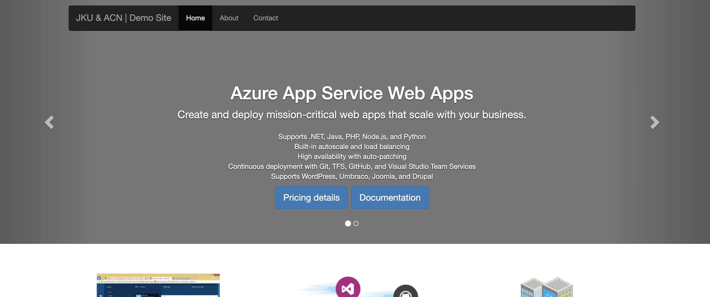
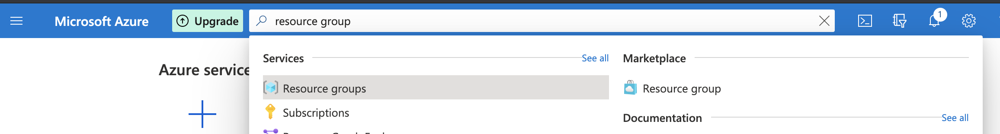
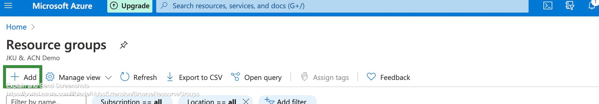
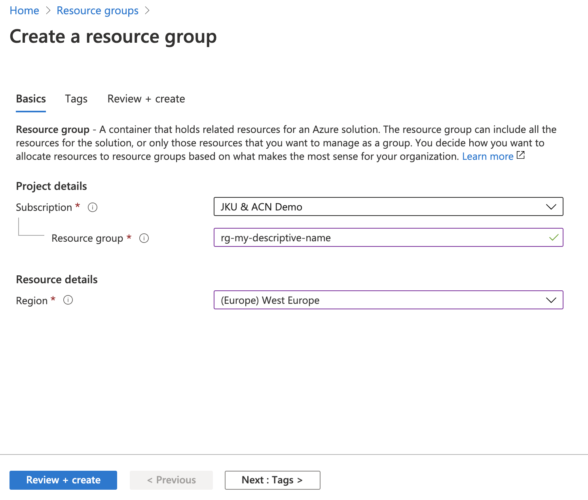
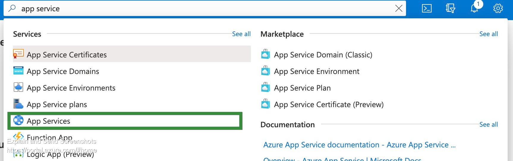
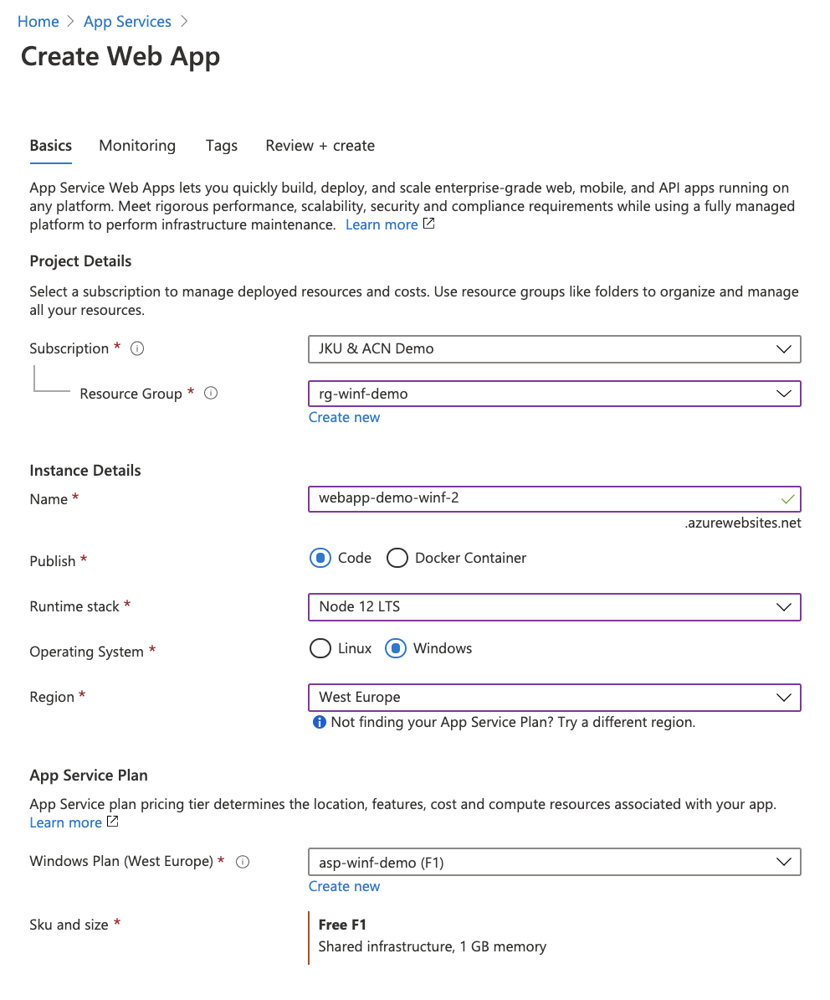
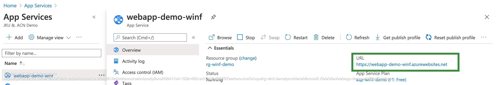
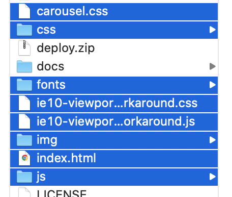

# Intro

A short demo into the Azure Cloud, by showcasing that with a few clicks, we can leverage the computing power of the cloud to host a simple website.

We will make use of:

- Azure Cloud (Subscriptions required)
- App Service (PaaS/Serverless service of Azure)
- git (to clone this example site)
- az cli (to deploy our site to the cloud)

# Getting started

## Download the website

Download the example site using `git`. These are the sources that we want to deploy to the cloud later on.

```bash
git clone https://github.com/demowinf/azure-tech-demo.git
cd azure-tech-demo
```

> Disclaimer: The example site used here is an adapted version https://github.com/Azure-Samples/app-service-web-html-get-started

The example site is pure html/css/js and looks like this



## Create cloud services

Now we need to create the cloud services. We will now create a `resource group` and an `app service` using the Azure portal.

- Goto https://portal.azure.com and login.

**Creating the resource group**

- Search for "resource group" at the searchbar at the top, and click on the "resource group" service.
  
- Add a new resource group
  
- Click through the creation by providing a descriptive name
  

**Creating the app service**

This service is used to host our website. #PaaS #Serverless

- Search for "app service" at the searchbar at the top, and click on the "app services" service.
  
- Add a new app serivce
- Click through the creation by selecting
  - the resource group you created
  - provide a name for your web app (this will also be the url provided by azure)
  - Publish: Code
  - Runtime stack: Node 12 LTS
  - OS: Windows
  - Region: West Europe
  - Create new app service plan: Free F1 (or higher)
  

Wait until it is created and on the overview page you can see the public URL for your app.


## Deploy your website

Now that we have our cloud resources, lets get our website deployed. We will use the azure cli in this example, for the other options check the [Next Steps](#next-steps) section.

In the azure-tech-demo root directory create a zip file of the files that we want to deploy to the cloud.
In our case all html, css and js files.



To get the files deployed issue following commands in your terminal

```bash
# first we need to authenticate with our azure account, this will prompt a login via browser
az login
# the deploy command, replace with your resource group, app service name, and your zip file
az webapp deployment source config-zip --resource-group rg-winf-demo --name webapp-demo-winf --src deploy.zip
```

Once this is finished, your site should be available under the public URL of the app.

# Next Steps

This is only the beginning, some pointers on how to improve and play more around with the app service

- [App Service Documentation](https://docs.microsoft.com/en-us/azure/app-service/)
  - [Monitoring for App Service](https://docs.microsoft.com/en-us/azure/app-service/troubleshoot-diagnostic-logs#enable-application-logging-windows) (e.g. check logs)
  - [Scale or change pricing tier](https://docs.microsoft.com/en-us/azure/app-service/manage-scale-up#scale-up-your-pricing-tier) (e.g. to access additional features)
  - [Restrict access](https://docs.microsoft.com/en-us/azure/app-service/app-service-ip-restrictions) (e.g. only your IP, Hint: a higher pricing tier will be necessary if you use free tier)
  - [Advanced: Custom Domain Name](https://docs.microsoft.com/en-us/azure/app-service/manage-custom-dns-buy-domain)

To get more familiar with Azure cloud

- [Azure Fundamentals Learning Path](https://docs.microsoft.com/en-us/learn/certifications/exams/az-900?wt.mc_id=learningredirect_certs-web-wwl&tab=tab-learning-paths#two-ways-to-prepare) (great free online course to learn fundamentals about cloud and azure, and also prepares you for the AZ-900 Azure Certification)